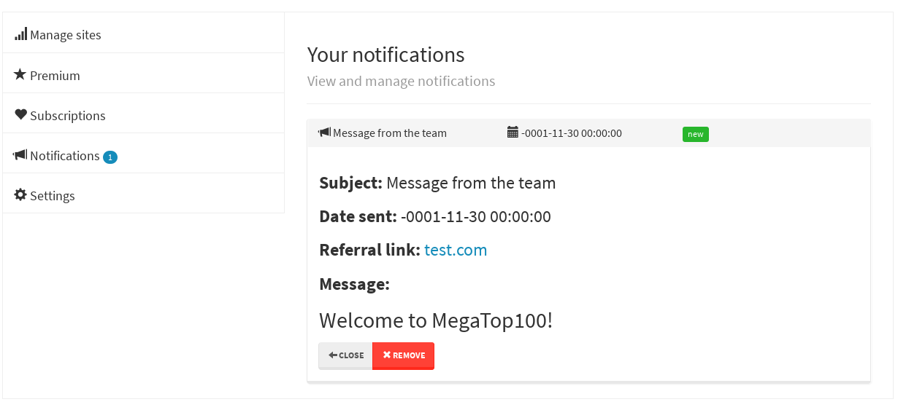

# GameTop100


GameTop100 is a game advertisement web application written in Laravel &  AngularJS  
The service provides a platform for game company owners to advertise their games whereby users  
can vote for games daily and advertisement results are ranked based on the highest  
voted games to also help players find popular and quality games 

## Features

#### Account creation
Game owners will need to create an account with GameTop100 to manage their advertisements


#### Sign-in


#### Advertisement comments
Users can give feedback on a game advertisement


#### Advertisement Management
Game owners can manage their advertisements by creating new ones, editting and removing them


#### Notifications
Users can receive notifications 



## Getting started

### Prerequisites
- PHP 5.5+
- MySQL 5.6+
- Laravel 4
- Composer
- AngularJS

### Installation
- Clone the GameTop100 repository
Make sure the repository is in your web server www root i.e. `htdocs` in XAMPP

```
git clone https://github.com/kyleruss/GameTop100.git
```

- Install laravel 
```
composer install
```

- Create the database tables by running the migration scripts
```
php artisan migrate
```

- Connect via `http://localhost/GameTop100/public`

## License
GameTop100 is available under the MIT License  
See [LICENSE](LICENSE) for more details
